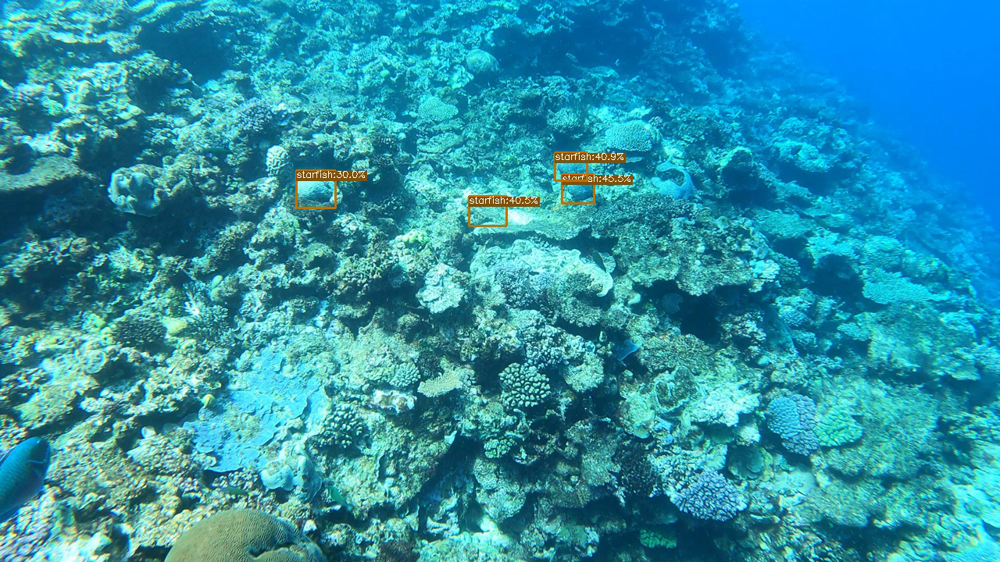
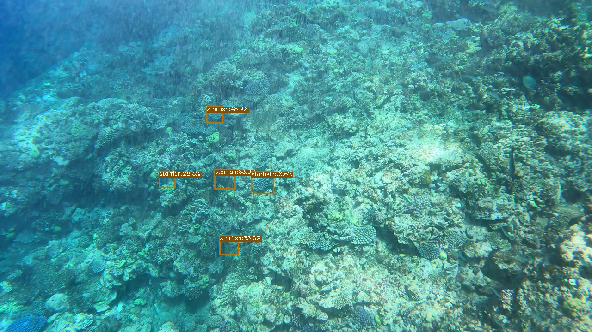

# COTS-YoloX
My Baseline Solution for COTS(crown-of-thorns starfish) Competition in Kaggle using YoloX for Multi-Object Detection.

# Goal of the Competition
The goal of this competition is to accurately identify starfish in real-time by building an object detection model trained on underwater videos of coral reefs.

Your work will help researchers identify species that are threatening Australia's Great Barrier Reef and take well-informed action to protect the reef for future generations.

# Some Results

  

  

